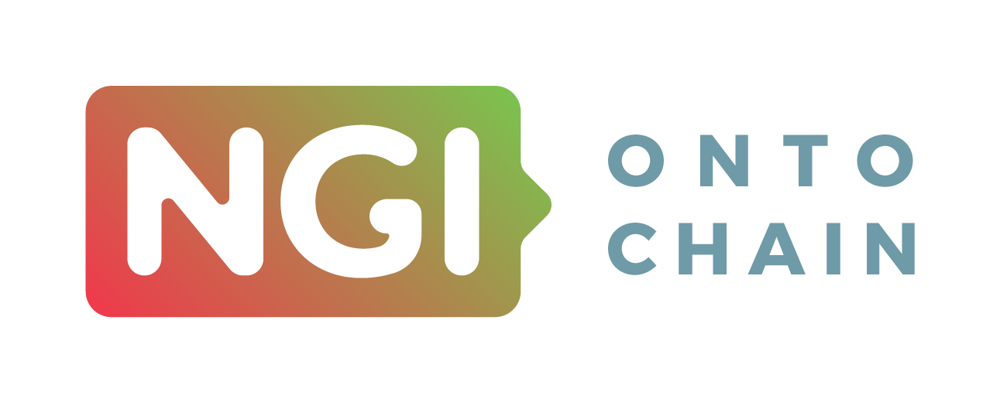

# 

**Overview**
> My3Sec is a immutable and trusted record of personal skills. The project will exploit the blockchain to provide a trusted log of time spent on activities or projects, that is later used as the ground truth to extract a verifiable personal skill portfolio. Employers automatically obtain the hours spent on a given project and, on the other hand, recruiters use My3sec as a search engine for workers with a skills that match company or project requirements.

## About

*Yet to be defined*

## Main Innovation

In its core, My3Sec introduces novelty in changing the traditional working relations between companies and employees. Through the usage of blockchain, it enables to create a trustworthy environment, in which workers can objectively know the tasks that they need to perform and companies have an immutable record of the amount of hours spent in each task. Further, it also employs a feedback mechanism to evaluate the quality of the delivered task. This functionality allows users to have a reliable way to track their personal growth in different skills. It is also beneficial to companies that optimize their task allocation, by matching the expertise of the employees to the set of required abilities to perform a particular task. 

## Usage

*Yet to be defined*

## Contact

[VAIMEE](vaimee.com) - [@MaVaimee](https://twitter.com/MaVaimee) - [info@vaimee.com](mailto://info@vaimee.com)

### Acknowledgements
This project has received funding from the European Union’s Horizon 2020 research and innovation program through the NGI ONTOCHAIN program under cascade funding agreement No 957338

<a href="https://ontochain.ngi.eu/">
</img>
</a>
