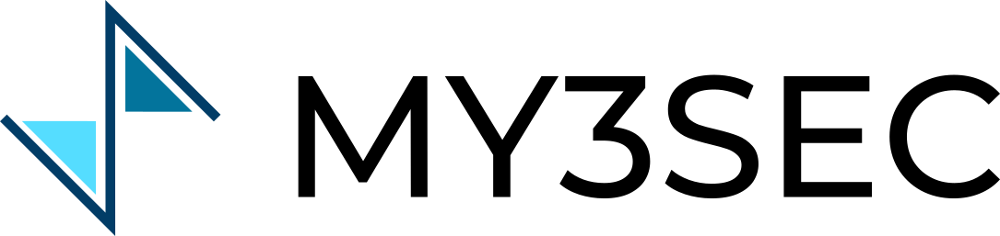

# Contracts

**Overview**

> My3Sec is a immutable and trusted record of personal skills. The project will exploit the blockchain to provide a trusted log of time spent on activities or projects, that is later used as the ground truth to extract a verifiable personal skill portfolio. Employers automatically obtain the hours spent on a given project and, on the other hand, recruiters use My3sec as a search engine for workers with a skills that match company or project requirements.

## Getting started

_To be defined_

### Deployement

| Contract | Address                                                                                                                                           |
| -------- | ------------------------------------------------------------------------------------------------------------------------------------------------- |
| My3Sec   | [0x50dBb1F53c948c8471Eb44Be4B45a7860c57B5C1](https://blockscout-bellecour.iex.ec/address/0x50dBb1F53c948c8471Eb44Be4B45a7860c57B5C1/transactions) |
